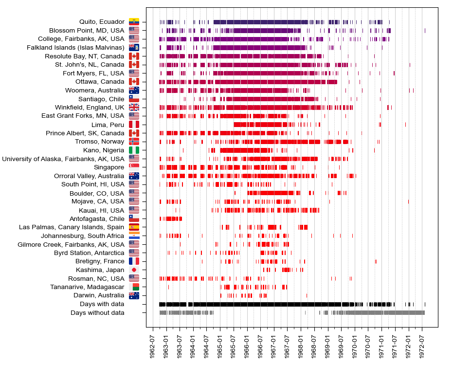
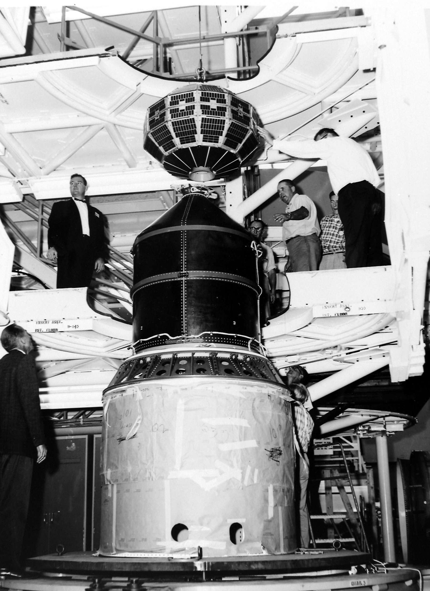

 
 

- [En Français](https://github.com/asc-csa/Alouette_extract/blob/working/README.md#alouette-1---extraction-de-donn%C3%A9es-dionogrammes---donn%C3%A9es-du-premier-satellite-canadien-en-d%C3%A9veloppement-depuis-plus-de-60-ans)

# Alouette-1 - Ionogram Data Extraction - Data from Canada's First Satellite Over 60 Years In the Making

Alouette-1 is the swept-frequency topside sounder experiment that initiated Canada’s participation in space. At a time when satellites were designed and expected  to last only a few months, Alouette-1 transmitted data over 10 years to a growing international network of telemetry stations from 1962 – 72. Over this period of time the telemetry data were processed over thousands of hours by the DRTE data processing facility  at Shirley’s Bay, Ottawa – leading to hundreds of scientific publications in its time, and a family of ionospheric satellites (Alouette-2, Explorer-31, ISIS-1 and ISIS-2).

> The efforts of the unusually competent and dedicated members of the Canadian team…led to Canada’s spectacular entry into the space age with Alouette 1 on September 29, 1962.

Yet, decades later the data was nearly lost, if not for the foresight and effort to save it. Now, the data has been digitized, processed and extracted, and could be used with today’s computational methods to produce a more comprehensive model of Earth’s topside ionosphere in the 1960s - or anything else!

## How to Get Started

<b>Figure 1:</b> (left) Extracted datapoints mapped to a depth-frequency space; (right) the corresponding scanned image of the
ionogram. / (à gauche) Points de données extraits cartographiés dans un espace de fréquence de profondeur ; (à droite) l'image scannée correspondante de l'ionogramme.
 
 

**To learn how to access, work with and even re-process the data, read:**

- [**Alouette-1 – Ionogram Data Extraction Methodology**](https://github.com/asc-csa/Alouette_extract/blob/working/documentation/Alouette-1%20-%20Ionogram%20Data%20Extraction%20Methodology-latest_ver.pdf)

**There are important details about the historical context of the Alouette-1 mission and its data. You will benefit from reading:**

- [**Alouette-1 – A History of The Data from Canada’s First Satellite Over 60 Years (Naidoo, 2023)**](https://github.com/asc-csa/Alouette_extract/blob/working/documentation/Alouette-1%20-%20A%20History%20of%20The%20Data%20from%20Canadas%20First%20Satellite%20Over%2060%20Years.pdf)
	- A historical account of Alouette-1's data from early design decisions, to how the data was first recorded, to the data restoration efforts of today.

- [**Alouette-1 - 2017 Data Restoration (Lessard, 2017**)](https://github.com/asc-csa/Alouette_extract/blob/working/documentation/Alouette-1%20-%202017%20Data%20Restoration.pdf)
	- Initial documentation of the CSA's 35 mm film mass digitization effort, that started in 2017. 
 
 

<b>Figure 2:</b> Current availability in days of Alouette-1 extracted data, by ground station. / Disponibilité actuelle en jours des données extraites d'Alouette-1, par station au sol.
 
 

<b>Figure 3:</b> Animation of scanned ionograms ('num' metadata type) from 35 mm negative film roll. / Animation d'ionogrammes numérisés (type de métadonnées "num") à partir d'un rouleau de film négatif de 35 mm.
 
 

---

# Alouette-1 - Extraction de données d'ionogrammes - Données du premier satellite canadien en développement depuis plus de 60 ans

Alouette-1 a marqué le début de la participation du Canada à l'exploration de l'espace grâce à son expérience de sondeur de surface à fréquence balayée. À une époque où les satellites étaient conçus pour ne durer que quelques mois, Alouette-1 a transmis des données pendant 10 ans, de 1962 à 1972, à un réseau international croissant de stations de télémétrie. Pendant cette période, les données de télémétrie furent traitées pendant des milliers d'heures par l'installation de traitement des données du DRTE à Shirley's Bay, Ottawa, ce qui a donné lieu à des centaines de publications scientifiques et à une famille de satellites ionosphériques (Alouette-2, Explorer-31, ISIS-1 et ISIS-2).

> Les efforts des membres exceptionnellement compétents et dévoués de l'équipe canadienne ont conduit à l'entrée spectaculaire du Canada dans l'ère spatiale avec Alouette 1, le 29 septembre 1962.

Pourtant, des décennies plus tard, ces données précieuses ont failli être perdues, sans la prévoyance et les efforts déployés pour les sauvegarder. Aujourd'hui, les données ont été numérisées, traitées et extraites. Elles pourraient, entre autre, être utilisées avec les méthodes informatiques actuelles pour produire un modèle plus complet de l'ionosphère de la surface de la Terre dans les années 1960.

## Comment démarrer

Pour savoir comment accéder aux données, les utiliser et même les retraiter, lisez le document suivant :

- [Alouette-1 - Méthodologie d'extraction des données d'ionogrammes (en Anglais)](https://github.com/asc-csa/Alouette_extract/blob/working/documentation/Alouette-1%20-%20Ionogram%20Data%20Extraction%20Methodology-latest_ver.pdf)
	- 16 pages - à noter que l'aperçu de GitHub ne montre que les 5 premières pages

Il y a des détails importants sur le contexte historique de la mission Alouette-1 et de ses données. La lecture de ce document vous sera utile :

- [Alouette-1 - Une histoire des données du premier satellite canadien sur 60 ans (Naidoo, 2023) (en Anglais)](https://github.com/asc-csa/Alouette_extract/blob/working/documentation/Alouette-1%20-%20A%20History%20of%20The%20Data%20from%20Canadas%20First%20Satellite%20Over%2060%20Years.pdf)
	- Un historique des données d'Alouette-1, depuis les premières décisions de conception jusqu'aux efforts actuels de restauration des données, en passant par l'enregistrement initial des données.
	- 21 pages - à noter que l'aperçu de GitHub ne montre que les 5 premières pages

- [Alouette-1 - Restauration des données 2017 (Lessard, 2017) (en Anglais)](https://github.com/asc-csa/Alouette_extract/blob/working/documentation/Alouette-1%20-%202017%20Data%20Restoration.pdf)
	- Documentation initiale de l'effort de numérisation de masse des films 35 mm de l'ASC, qui a débuté en 2017. 
 
 

---

## Special Thank You / Un Gros Merci
Dr. Colin A Franklin, Chief Electrical Engineer for Alouette-1, Defence Research Telecommunications Establishment of Canada
 
 

---

## Credits
### Data and Emerging Technologies (CSA) / Données et technologies émergentes (ASC) 
- Ravendra Naidoo
- Roksana Sheikholmolouki
- Ashley Ferreira
- Jackson Cooper
- Marianne Fortier
- Benjamin ('JJ') Cannings
- Émiline Filion
- Natasha Fee

### Past Data Science Team (CSA) / Ancienne équipe de science des données (ASC)
- Etienne Low-Décarie 
- Jenisha Patel  
- Wasiq Mohammad
- Hansen Liu

### Open Government (CSA) / Gouvernement ouvert (ASC)
- Natalina Mariani
- Jean-Sebastien Hunter

### Infrastructure Operations (CSA) / Opérations d'infrastructure (ASC)
- Mateusz Gola

### Chief Information Officer (CSA) / Chef du bureau d'information (ASC)
- Josée Saint-Marseille

### Space Utilization (CSA) / Utilisation de l'espace (ASC)
- Pierre Langlois

### Space Exploration (CSA) / Exploration spatiale (ASC)
- Louis-Paul Bédard

 
 

<b>Figure 4:</b> Alouette-1 installed on the Thor-Agena B rocket. Credit: Communications Research Center Canada (CRC) / Alouette-1 installée sur la fusée Thor-Agena B. Crédit : Centre de recherches sur les communications Canada (CRC)

